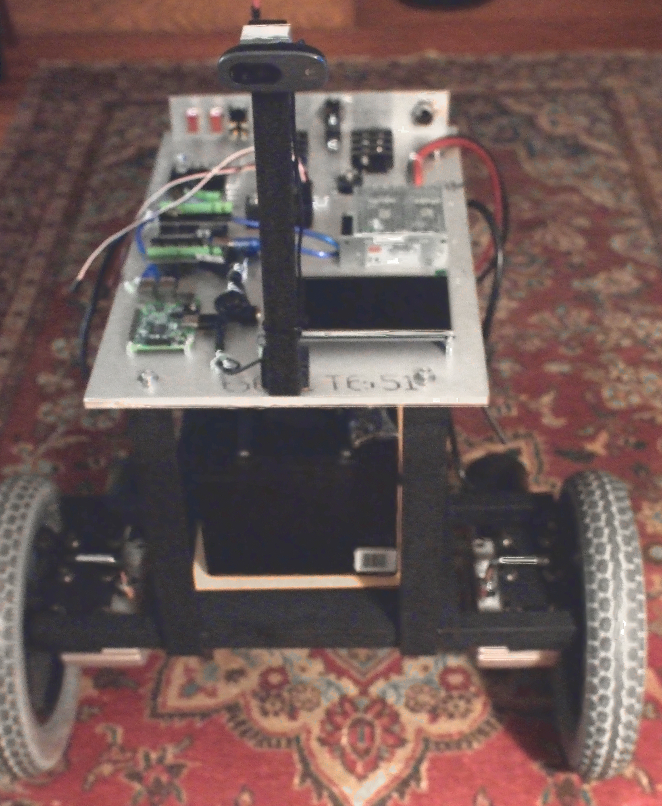

# __200 Pound Behavior Cloning Robot__

This is code for the 200 pound behavior cloning robot I am building.  It
uses two independent drive wheels and a third non-driven swivel wheel.
The purpose of this design is simplicity in control, efficient movement on 
relatively smooth surfaces, and the ability to make very fast turns.

## __Goals__

The goal is to be able to learn how to navigate based on video stimulus,
with training accomplished as fast as possible (on the order of minutes).  
The framework is a fully connected network for learning, with preprocessing 
to reduce the feature space to a size that is managable with the constraints 
on training time.  The design objective is that all tasks are able to be
accomplished in real time on a Rasbperry Pi.

## __Hardware__

There are two incoming data streams: 1) video of the road in front, 
which is handled on a Raspberry Pi using V4L; and 2) information about control 
mode, speed and throttle from an Arduino that debounces switches and 
intercepts standard RC PWM signals. A Dimension Engineering Sabertooth dual 
32A motor drive is used to control the two drive motors.  

## __Software__

The design of the code is such that the main control structure is clear
and simple, with simple constructs for changing hyperparameters. With a few 
exceptions that are written in C for control and speed, all code is written 
in OCaml and uses standard libraries. 

OCaml (and most garbage collected functional languages) are not performant
for tasks involving sequentially accessed numeric computation.  Since this 
is the core problem backpropagation, these operations have been written in C.  
A custom frame grabber using V4L was written to meet design specifications.
Video pre-processing is based on ad hoc methods to significantly reduce the 
features space for the fully connected network, as careful attention to 
the VC dimension is critical to attain the desired performance.  A cache-
aligned version of the standard Bigarray is introduced to get slightly 
better performance.

## __Build Requirements - Main System__

you will need the following things on your Raspberry Pi:

System stuff:
    * Kernel headers (for v4l2)
    * v4l2 and associated utilities (v4l2-dev, v4l2-ctl, etc.)
    * libjpeg (basically for debugging camera issues by optionally saving to file)

gcc stuff:
    * Modern toolchain (gcc 4.9.2)

OCaml stuff:
    * Modern toolchain (4.03.0) 

Raspberry Pi specific configuration:
    * Add the following to /boot/cmdline.txt
        - dwc_otg.fiq_fsm_mask=0x3 

LCD display:
    * Add the following to /boot/config.txt
        - gpu_mem=16
        - hdmi_group=2
        - hdmi_mode=4

## __Build Requirements - Arduino__

    * RCArduino (???)

## __To Do__

    1. Fix the backpropagation C code
    2. Determine proper ad hoc method for image pre-processing
    3. Document the Arduino requirements
    4. Add the Arduino code base

